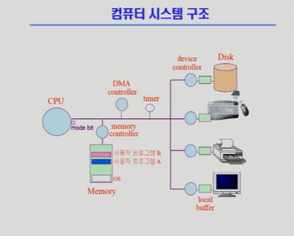
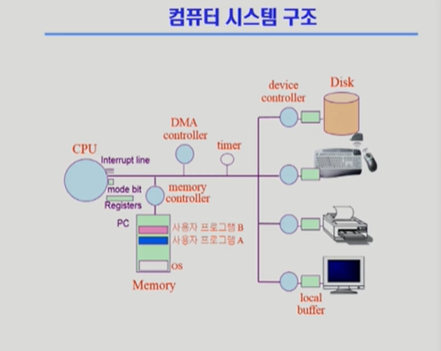
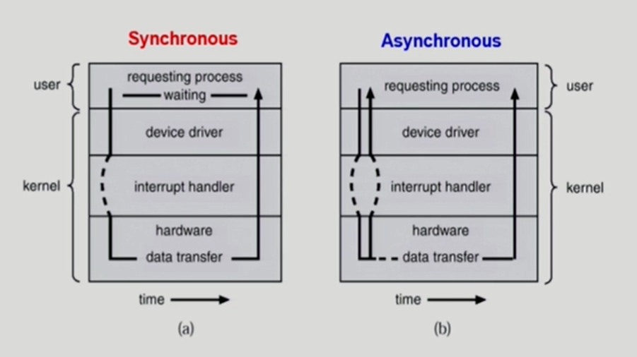
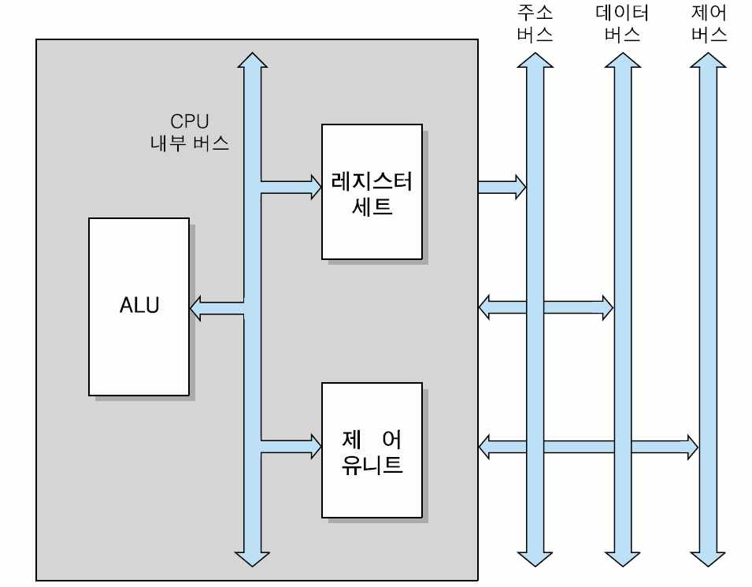
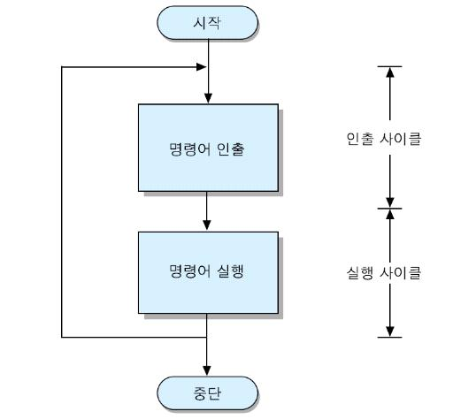
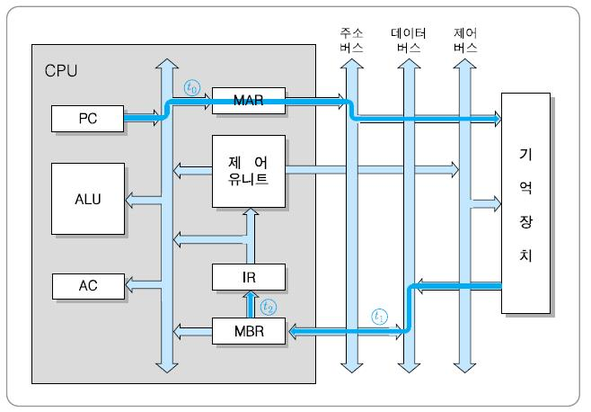
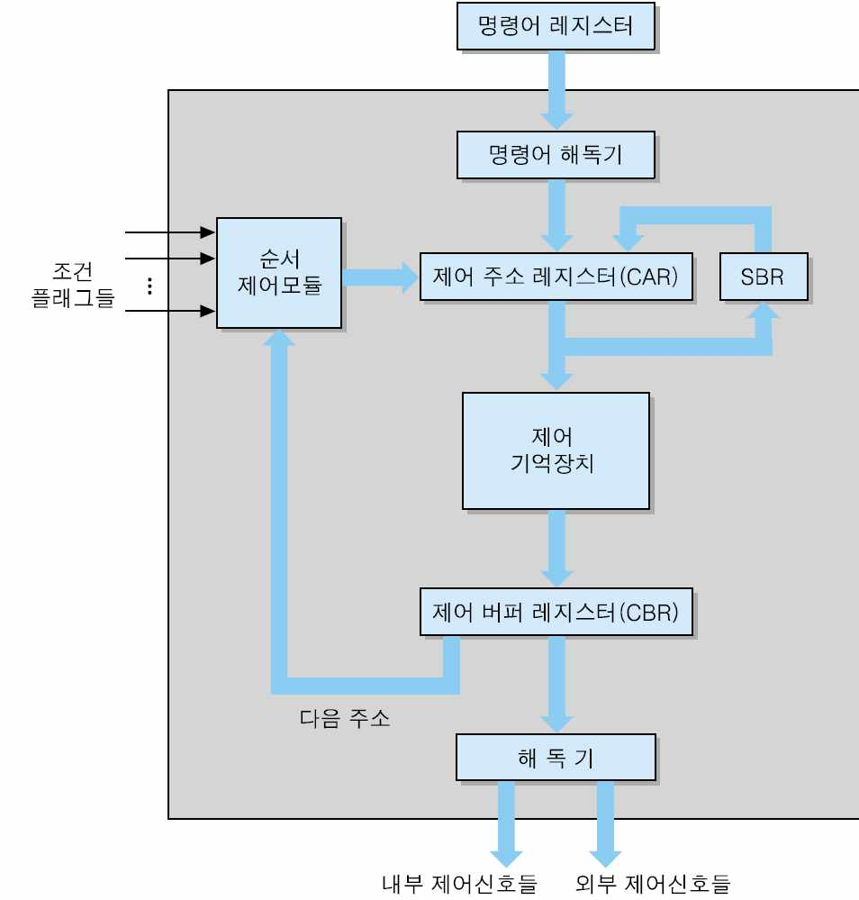

# 02_컴퓨터 시스템 구조 🗃️

- 컴퓨터 전원을 키면 운영체제가 메모리에 상주한다.
- 프로그램 실행을 시키면 해당 프로그램이 메모리에 올라가서 프로세스가 된다.

- **Device controller (디바이스 컨트롤러) :** 디바이스가c 관리하는 작은 CPU
- **Local buffer (로컬 버퍼)** : 디바이스의 작은 메모리

---

> **mode bit (모드빗)**

- 사용자 프로그램의 잘못된 수행으로 다른 프로그램 및 운영체제에 피해가 가지 않도록 하기 위한 보호장치 필요
- 하드웨어적으로 두가지 모드 operation 지원

💡 **1** (사용자 모드) : 사용자 프로그램 수행
💡 **0** (모니터모드 = 커널모드, 시스템모드) : OS 코드 수행

​        

- 보안을 해칠 수 있는 중요한 명령어는 모니터 모드에서만 수행가능한 “특권명령”으로 규정
- interrupt나 exception 발생시 하드웨어가 mode bit을 0으로 바꿈
- 사용자 프로그램에게 cpu를 넘기기 전에 mode bit을 1로 셋팅
- CPU가 위험한 기계어인지 mode bit을 통해 파악

---

> **CPU interrupt line**
> 

- 인터럽트는 I/O 디바이스가 발생 시킬 수 있다.
  
- 과정
    1. CPU → 디스크 컨트롤러에게 부탁한다. 컨트롤러가 일하는 동안에 CPU는 다른 프로그램을 진행하고 있다. 
    2. 디스크 컨트롤러에게 요청한 것이 끝나면 CPU에게 인터럽트를 건다. 
    3. 다음 기계어 실행하기 앞어서 인터럽트를 확인하고 인터럽트가 들어왔으면 인터럽트는 자동적으로 운영체재로 넘어간다.
    4. 모드빗이 0으로 바뀌고 운영체제가 CPU를 잡아서 일을 한다.
    5. CPU를 다른 프로그램으로 넘길 때는 모디빗이 1로 변경시킨다.

- CPU 안에는 레지스터 들이 있다.
- 프로그램 카운터라는 레지스터는 주소를 가지고 있다.
- 프로그램 카운터가 가리키고 있는 메모리에서 데이터를 가져와서 실행한다.

- 운영체제는 CPU를 넘겨줄 수 있지만
- 운영체제가 CPU를 뺏어올 수는 없다.

- CPU 독점을 막기 위해서는 부가적인 타이머라는 하드웨어를 가지고 있다. 일정시간 간격으로 타이머 인터럽트를 발생시킨다.
- 하드웨어적인 원칙! ⇒ 인터럽트가 들어오면 프로그램 카운터는 무조건 OS를 가르키도록 한다.

---

> **타이머**
> 

- 정해진 시간이 흐른뒤 운영체제에게 제어권이 넘어가도록 인터럽트를 발생시킴
- 타이머는 매 클럭 틱 때 마다 1씩 감소
- 타이머 값이 0이되면 타이머 인터럽트 발생
- CPU를 특정 프로그램이 독점하는 것으로 부터 보호

- 타이머는 time sharing을 구현하기 위해 널리 이용됨
- 타이머는 현재 시간을 계산하기 위해서도 사용

- CPU가 I/O 장치로 접근하는 기계어는 특권명령
- 운영체제에게 해달라고 요청

---

> **시스템콜**
> 

- 사용자 프로그램이 운영체제의 서비스를 받기 위해 커널 함수를 호출 하는 것
- 소프트웨어가 본인이 직접할 수 없는 일을 OS에 부탁하기 위해서

---

- 소프트웨어 인터럽트

인터럽트

인터럽트 당한 시점의 레지스터와 program counter를 save한 후 CPU의 제어를 인터럽트 처리 루틴에 넘긴다.

- 넓은 의미
    - Interrupt (하드웨어 인터럽트) : 하드웨어가 발생시킨 인터럽트
    - Trap(소프트웨어 인터럽트)
        - exception : 프로그램이 오류를 범한 경우
        - system call : 프로그램이 커널 함수를 호출 하는 경우
    
- 인터럽트 관련 용어
    - 인터럽트 벡터
        - 해당인터럽트의 처리 루틴 주소를 가지고 있음
    - 인터럽트 처리 루틴 (Interrupt Service Routine, 인터럽트 핸들러)
        - 해당 인터럽트를 처리하는 커널 함수
    
    현재 운영체제는 인터럽트에 의해 구동됨
    

---

> **입출력**
> 

- **입출력(I/O)**이란 컴퓨터 시스템이 컴퓨터 외부의 주변 장치들과 데이터를 주고받는 것
- 입출력 방식에는 **동기식 입출력**과 **비동기식 입출력**이 있음
  
  
    1. **동기식 입출력 (synchronous I/O)**
        - I/O 요청 후 입출력 작업이 완료된 후에야 제어가 사용자 프로그램으로 넘어감
        
        1. 구현 방법_1 **(blocking)**
            - I/O가 끝날 때까지 CPU를 낭비시킴
            - 매시점 하나의 I/O만 일어날 수 있음
            
        2. 구현 방법_2 **(non-blocking)**
            - I/O가 완료될 때까지 해당 프로그램에게서 CPU를 빼앗음
            - I/O 처리를 기다리는 줄에 그 프로그램을 줄 세움
            - 다른 프로그램에게 CPU를 줌
        
    2. **비동기식 입출력 (asynchronous I/O)**
        - I/O가 시작된 후 입출력 작업이 끝나기를 기다리지 않고 제어가 사용자 프로그램으로 넘어감
    

- 두 경우 모두 I/O 완료는 인터럽트로 알려줌

---

> **DMA (Direct Memory Access)**
> 

- CPU 개입 없이 I/O 장치와 기억 장치 사이에서 데이터를 전송하는 방식
- CPU의 중재 없이 device controller가 device의 buffer storage의 내용을 메모리에 block 단위로 직접 전송
- 바이트 단위가 아니라 block 단위로 인터럽트를 발생 시킴
- 빠른입출력 장치를 메모리에 가까운 속도로 처리하기 위해서 사용

---

> **CPU의 기본 구조**
> 

1. **산술논리연산장치 (Arithmetic and Logical Unit: ALU)**
2. **레지스터 (Register set)**
3. **제어 유니트 (Control Unit)**

1. **레지스터 (Resgister)**
    - 액세스 속도가 가장 빠른 기억장치
    - CPU 내부에서 처리할 명령이나 연산의 중간 값들을 일시적으로 기억하는 임시 저장소
    - CPU 내부에 포함할 수 있는 레지스터들의 수가 제한됨
    - (특수 목적용 레지스터들과 적은 수의 일반 목적용 레지스터들)
    
    1. 범용 레지스터
        - 플립플롭 (Flip-Flop) : 플립플롭 구조의 레지스터 묶음
            - 두 개의 안정상태에서 한쪽을 보존하여 상태를 유지
        - 스크래치패드 (Scratch-Pad Memory) : 임시저장을 위한 고속 메모리
            - 작은 데이터 항목들을 주로 보관
    2. 특수 레지스터
        - 레지스터

---

> **명령어 실행**
> 

- **명령어 사이클 (instruction cycle)** : CPU가 한 개의 명령어를 실행하는데 필요한 전체 처리 과정으로서,
- CPU가 프로그램 실행을 시작한 순간부터 전원을 끄거나 회복 불가능한 오류가 발생하여 중단될 때까지 반복

- 인출 사이클(fetch cycle) : CPU가 기억장치로부터 명령어를 읽어오는 단계
- 실행 사이클(execution cycle) : 명령어를 실행하는 단계

- **명령어 실행에 필요한 CPU 내부 레지스터들**

1. 프로그램 카운터 (Program Counter : PC)
   
    다음에 인출할 명령어의 주소를 가지고 있는 레지스터
    
    각 명령어가 인출된 후에는 자동적으로 일정 크기 (한 명령어 길이) 만큼 증가
    
    분기 (branch) 명령어가 실행되는 경우에는 목적지 주소로 갱신
    
2. 누산기 (Accumulator : AC)
   
    데이터를 일시적으로 저장하는 레지스터
    
    레지스터의 길이는 CPU가 한 번에 처리할 수 있는 데이터 비트 수 (단어 길이)와 동일
    
3. 명령어 레지스터 (Instruction Register: IR)
   
    가장 최근에 인출된 명령어 코드가 저장되어 있는 레지스터
    
4. 기억장치 주소 레지스터 (Memory Address Register : MAR)
   
    PC에 저장된 명령어 주소가 시스템 주소 버스로 출력되기 전에 일시적으로 저장되는 주소 레지스터
    
5. 기억장치 버퍼 레지스터 (Memory Buffer Register : MBR)
   
    기억장치에 쓰여질 데이터 혹은 기억장치로 부터 읽혀진 데이터를 일시적으로 저장하는 버퍼 레지스터
    
- 데이터 레지스터 (DR : Data Resgiter)
    - 명령 수행시 주기억장치에서 가져온 데이터를 기억, 워드 크기과 같다. 주기억장치의 용량과 관계가 있음
    - 종류 : 누산기(AC), MBR, GPR (범용 레지스터)
- 주소 레지스터 (AR : Address Register)
    - 주기억장치의 주소의 일부 또는 전부를 기억
    - 종류 : PC, MAR, 베이스 레지스터(Base Register), 인덱스 레지스터(Index Register)
        - 베이스 레지스터 (Base Register) : 프로그램이 메모리에 A, B, C에 여러 개가 존재하면 각각의 프로그램의 주소를 가리킴
        - 인덱스 레지스터 (Index Register) : 특정한 데이터를 다른 곳으로 연속적으로 옮기고자 할 때, 두 위치를 지정해야함
        

---

> **I/O 장치 제어기 (I/O Device controller)**
> 

- CPU로부터 I/O 명령을 받아서, 해당 I/O 장치를 제어하고, 데이터를 이동함으로써 명령을 수행하는 전자회로 장치 (ex. 키보드 제어기, 프린터 제어기)
- 상태 레지스터
    - I/O 장치의 현재 상태를 나타내는 비트들을 저장한 레지스터
    - 준비 상태(RDY) 비트, 데이터 전송확인(ACK) 비트, 등
- 데이터 레지스터
    - CPU와 I/O 장치 간에 이동되는 데이터를 일시적으로 저장하는 레지스터
    

---

1. **제어 유니트**
    - 명령어 코드의 해독
    - 명령어 실행에 필요한 제어 신호들의 발생
    
    - 구성 요소
        - 명령어 해독기 (instruction decoder) : 명령어 레지스터(IR)로부터 들어오는 명령어의 연산 코드를 해독하여 해당 연산을 수행하기 위한 루틴의 시작 주소를 결정
        - 제어 주소 레지스터 (control address register : CAR) : 다음에 실행할 마이크로 명령어의 주소를 저장하는 레지스터 → 이 주소는 제어 기억장치의 특정 위치를 지칭
        - 제어 기억장치(control memory) : 마이크로명령어들로 이루어진 마이크로프로그램을 저장하는 내부 기억 장치
        
        - 제어 버퍼 레지스터 (control buffer resgister : CBR) : 제어 기억장치로부터 읽혀진 마이크로명령어 비트를 일시적으로 저장하는 레지스터
        - 서브루틴 레지스터 (subroutine register : SBR) : 마이크로 프로그램에서 서브루틴이 호출되는 경우에 현재의 CAR 내용을 일시적으로 장하는 레지스터
        - 순서제어 모듈 (sequencing module) : 마이크로명령어의 실행 순서를 결정하는 회로들의 집합
    
    